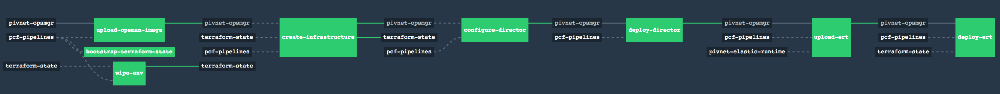

### Planned Deprecation
Please note that this repository will be officially deprecated soon.
New and better tools to replace this repo are under development.
While you are welcome to raise issues and pull requests,
not every issue will be prioritized.

### Description

This is a collection of [Concourse](https://concourse-ci.org) pipelines for
installing and upgrading [Pivotal Cloud Foundry](https://pivotal.io/platform).

Other pipelines which may be of interest are listed at the end of this README.




### Downloading PCF Pipelines

**Please use the [Pivotal Network release](https://network.pivotal.io/products/pcf-automation/) of `pcf-pipelines` for stability.  This link will result in 404 if you do not have access, to get access contact your Pivotal Support/Sales team.  Tracking master is considered unstable, and is likely to result in breaking the pipelines that consume it.**

If you do not have access to the Pivotal Network release, and you are using the GitHub release, for stability, please ensure you are tagging the pipeline.yml:

```yaml
 resources:
  - name: pcf-pipelines
  type: git
  source:
    uri: https://github.com/pivotal-cf/pcf-pipelines
    branch: master
    username: ((github_username))
    password: ((github_token))
    tag_filter: v0.23.0
```


### Install-PCF pipelines
Deploys PCF for whichever IaaS you choose. For public cloud installs, such as AWS, Azure, and GCP, the pipeline will deploy the necessary infrastructure in the public cloud, such as the networks, loadbalancers, and databases, and use these resources to then deploy PCF (Ops Manager and Elastic Runtime). On-premise private datacenter install pipelines, such as with vSphere and Openstack, do not provision any infrastructure resources and only deploy PCF, using resources that are specified in the parameters of the pipeline.

The desired output of these install pipelines is a PCF deployment that matches the [Pivotal reference architecture](http://docs.pivotal.io/pivotalcf/refarch), usually using three availability zones and opting for high-availability components whenever possible. If you want to deploy a different architecture, you may have to modify these pipelines to get your desired architecture.

These pipelines are found in the `install-pcf` directory, sorted by IaaS.


**Compatibility Matrix**

| IAAS | pipelines release | OM version | ERT version |
| :--- | --- | --- | --- |
| vSphere | v23.3 | 2.0.x  | 2.1.x  |
| Azure | v23.3 | 2.0.x | 2.1.x |
| AWS | v23.3 | 2.0.x | 2.1.x |
| GCP | v23.3 | 2.0.x  | 2.1.x  |
| OpenStack | v23 | 2.0.x  | 2.1.x  |

| IAAS | pipelines release | OM version | ERT version |
| :--- | --- | --- | --- |
| vSphere | v23.1 | 2.0.x  | 2.0.x  |
| Azure | v23.1 | 2.0.x | 2.0.x |
| AWS | v23.1 | 2.0.x | 2.0.x |
| GCP | v23.1 | 2.0.x  | 2.0.x  |
| OpenStack | v23 | 2.0.x  | 2.0.x  |

| IAAS | pipelines release | OM version | ERT version |
| :--- | --- | --- | --- |
| vSphere | v22 | 1.12.x  | 1.12.x  |
| Azure | v22 | 1.12.x | 1.12.x |
| AWS | v22 | 1.12.x | 1.12.x |
| GCP | v22 | 1.12.x  | 1.12.x  |
| OpenStack | v22 | 1.12.x  | 1.12.x  |


| IAAS | pipelines release | OM version | ERT version |
| :--- | --- | --- | --- |
| vSphere | v0.17.0 | 1.11.12  | 1.11.8  |
| Azure | v0.17.0 | 1.11.12  | 1.11.8  |
| AWS | v0.17.0 | 1.11.12  | 1.11.8  |
| GCP | v0.17.0 | 1.11.12  | 1.11.8  |

* Note: ERT v1.11.14 is not compatible with pcf-pipelines

### Upgrade pipelines
Used to keep your PCF foundation up to date with the latest patch versions of PCF software from Pivotal Network. They can upgrade Ops Manager, Elastic Runtime, other tiles, and buildpacks. You will need one pipeline per tile in your foundation, to keep every tile up to date, and one pipeline to keep Ops Manager up to date.

These upgrade pipelines are intended to be kept running for as long as the foundation exists. They will be checking Pivotal Network periodically for new software versions, and apply these updates to the foundation. Currently, these pipelines are only intended for patch upgrades of PCF software (new --.--.n+1 versions), and are not generally recommended for minor/major upgrades (--.n+1.-- or n+1.--.-- versions). This is because new major/minor upgrades generally require careful reading of the release notes to understand what changes will be introduced with these releases before you commit to them, as well as additional configuration of the tiles/Ops Manager (these upgrade pipelines do not have any configure steps, by default).

These pipelines are found in any of the directories with the `upgrade-` prefix.

The upgrade-tile pipeline is compatible with the latest version of pcf-pipelines. However, as discussed, this pipeline is only used for patch upgrades. 

## Prerequisites

- [install a Concourse server](https://concourse-ci.org/installing.html)
- download the [Fly CLI](https://concourse-ci.org/fly-cli.html) to interact with the Concourse server
- depending on where you've installed Concourse, you may need to set up
[additional firewall rules](FIREWALL.md "Firewall") to allow Concourse to reach
third-party sources of pipeline dependencies

## Usage

1. Log in to [Pivotal Network](https://network.pivotal.io/products/pcf-automation) and download the latest version of PCF Platform Automation with Concourse (PCF Pipelines).

1. Each pipeline has an associated `params.yml` file. Edit the `params.yml` with details related to your infrastructure.

1. Log in and target your Concourse:
   ```
   fly -t yourtarget login --concourse-url https://yourtarget.example.com
   ```

1. Set your pipeline with the `params.yml` file you created in step two above. For example:
   ```
   fly -t yourtarget set-pipeline \
     --pipeline upgrade-opsman \
     --config upgrade-ops-manager/aws/pipeline.yml \
     --load-vars-from upgrade-ops-manager/aws/params.yml
   ```

1. Navigate to the pipeline url, and unpause the pipeline.

1. Depending on the pipeline, the first job will either trigger on its own or the job will require manual intervention. Some pipelines may also require manual work during the duration of the run to complete the pipeline.

## Customizing the pipelines

It's possible to customize `pcf-pipelines` to suit your particular needs using
[`yaml-patch`](https://github.com/pivotal-cf/yaml-patch).


This tool supports all operations from [RFC-6902](https://tools.ietf.org/html/rfc6902) (for YAML documents instead of JSON). which can be applied to a source YAML file, such as `pcf-pipelines` pipeline definition files. It allows for a repeatable and automated mechanism to apply the same local customization operations to one or more pipeline YAML files for every new release of `pcf-pipelines` that gets delivered.


#### Example of yaml-patch usage

For a source YAML file containing just one element in its `jobs` array, here is how to add a second job element to it.

1. Source YAML: `source.yml`  
```  
---  
jobs:  
- name: first-job  
  plan:  
  - get: my-resource  
```  
2. Operations file: `add-job.yml`  
```  
- op: add  
  path: /jobs/-  
  value:  
    name: second-job  
    plan:  
    - get: my-second-resource  
```  
3. Execute `yaml-patch` command  
   `cat source.yml | yaml-patch -o add-job.yml > result.yml`    

4. Resulting patched file: `result.yml`  
```  
---  
jobs:  
- name: first-job  
  plan:  
  - get: my-resource  
- name: second-job  
  plan:  
  - get: my-second-resource  
```  


#### Additional samples of yaml-patch usage patterns

See file [yaml-patch-examples.md](docs/yaml-patch-examples.md) for additional `yaml-patch` samples and usage patterns.


## Deploying and Managing Multiple Pipelines

There is an experimental tool which you may find helpful for deploying and managing multiple customized pipelines all at once, called [PCF Pipelines Maestro](https://github.com/pivotalservices/pcf-pipelines-maestro). It uses a single pipeline to generate multiple pipelines for as many PCF foundations as you need.

## Pipeline Compatibility Across PCF Versions

Our goal is to at least support the latest version of PCF with these pipelines. Currently there is no assurance of backwards compatibility, however we do keep past releases of the pipelines to ensure there is at least one version of the pipelines that would work with an older version of PCF.

Compatibility is generally only an issue whenever Pivotal releases a new version of PCF software that requires additional configuration in Ops Manager. These new required fields then need to be either manually configured outside the pipeline, or supplied via a new configuration added to the pipeline itself.

## Pipelines for Airgapped Environments

By default, the pipelines require outbound access to the Internet to pull resources such as releases from Pivotal Network and images from DockerHub. Various aspects of the pipelines need to be modified for them to work on an airgapped environment.

To help with the modification and adaptation of the pipelines for such environments, two sample transformation/bootstraping pipelines are provided in this repository:

- [`create-offline-pinned-pipelines`](https://github.com/pivotal-cf/pcf-pipelines/tree/master/create-offline-pinned-pipelines): adapts `pcf-pipelines` to run on airgapped environments and downloads required resources into a S3 repository.
- [`unpack-pcf-pipelines-combined`](https://github.com/pivotal-cf/pcf-pipelines/tree/master/unpack-pcf-pipelines-combined): bootstraps an airgapped S3 repository with the produced offline pipelines and resources from `create-offline-pinned-pipelines`.

For more details on these pipelines, along with usage instructions, refer to the *[Offline Pipelines for Airgapped Environments](https://github.com/pivotal-cf/pcf-pipelines/blob/master/docs/offline-pipelines.md)* documentation page.


## Contributing

### Pipelines and Tasks

For practicalities, please see our [Contributing](https://github.com/pivotal-cf/pcf-pipelines/blob/master/CONTRIBUTING.md) page for more information.

The pipelines and tasks in this repo follow a simple pattern which must be adhered to:

```
.
├── some-pipeline
|   ├── params.yml
|   └── pipeline.yml
└── tasks
    ├── a-task
    │   ├── task.sh
    │   └── task.yml
    └── another-task
        ├── task.sh
        └── task.yml
```

Each pipeline has a `pipeline.yml`, which contains the YAML for a single
Concourse pipeline. Pipelines typically require parameters, either for resource
names or for credentials, which are supplied externally via `((placeholders))`.

A pipeline may have a `params.yml` file which is a template for the parameters
that the pipeline requires. This template should have placeholder values,
typically CHANGEME, or defaults where appropriate. This file should be filled
out and stored elsewhere, such as in LastPass, and then supplied to `fly` via
the `-l` flag. See the
[fly documentation](http://concourse-ci.org/fly-set-pipeline.html) for more.

#### Pipelines

Pipelines should define jobs that encapsulate conceptual chunks of work, which
is then split up into tasks within the job. Jobs should use `aggregate` where
possible to speed up actions like getting resources that the job requires.

Pipelines should not declare task YAML inline; they should all exist within a
directory under `tasks/`.

#### Tasks

Each task has a `task.yml` and a `task.sh` file. The task YAML has an internal
reference to its `task.sh`.

Tasks declare what their inputs and outputs are. These inputs and outputs
should be declared in a generic way so they can be used by multiple pipelines.

Tasks should not use `wget` or `curl` to retrieve resources; doing so means the
resource cannot be cached, cannot be pinned to a particular version, and cannot
be supplied by alternative means for airgapped environments.

#### Running tests

There are a series of tests that should be run before creating a PR or pushing
new code. Run them with ginkgo:

```
go get github.com/onsi/ginkgo/ginkgo
go get github.com/onsi/gomega
go get github.com/concourse/atc

ginkgo -r -p
```

#### Other notable examples of pipelines for PCF

[PCFS Sample Pipelines](https://github.com/pivotalservices/concourse-pipeline-samples) - includes pipelines for
- integrating Artifactory, Azure blobstores, GCP storage, or Docker registries
- blue-green deployment of apps to PCF
- backing up PCF
- deploying Concourse itself with bosh.
- and more...
