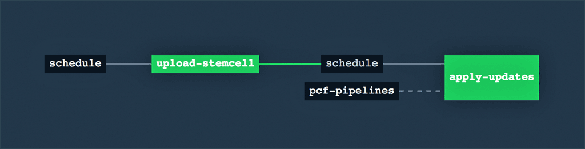
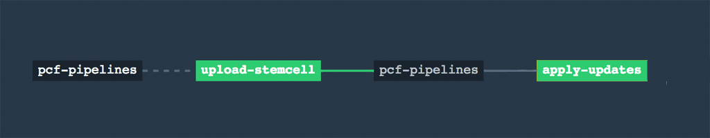
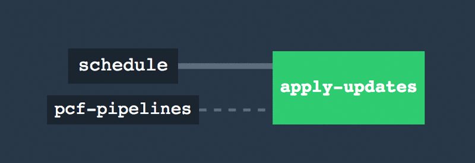

# Apply Updates pipeline

This pipeline executes the `Apply changes` of an Ops Manager to process all staged tiles and pending updates.

The standalone `apply-updates` job allows for updates to be applied at once rather than on a per-tile basis.

This pipeline can also prevent pipeline collision so that you can schedule when upgrades or updates are actually applied.



### Use cases

- Stage multiple tiles for upgrade on Ops Manager and apply changes only once in order to minimize any potential impact on the platform

- Schedule the apply changes execution to be done on a regular basis (e.g. daily) or off-hours

- Perform scheduled stemcell version check and upgrades for the platform

## Usage

1. Log in to [Pivotal Network](https://network.pivotal.io/products/pcf-automation) and download the latest version of PCF Platform Automation with Concourse (PCF Pipelines).

1. Edit the [`apply-updates/params.yml`](params.yml) file with details related to your infrastructure.

1. Log in to your Concourse and set your pipeline with the `params.yml` file you created in step two above.
   ```
   fly -t <yourtarget> login --concourse-url https://yourtarget.example.com
   fly -t <yourtarget> set-pipeline \
     --pipeline apply-updates \
     --config apply-updates/pipeline.yml \
     --load-vars-from apply-updates/params.yml
   ```

1. Navigate to the pipeline url, and un-pause the `apply-updates` pipeline.   
   The first job will either trigger on its own or will require manual intervention depending on whether or not you kept the `schedule` resource in your pipeline and on the time selected for that scheduler.   
   When using the scheduler in the pipeline, you can force it to trigger an event by using the following command:
   ```
   fly -t <yourtarget> check-resource --resource=apply-updates/schedule
   ```


## Customizing the pipeline

- [Changing the time of the pipeline's scheduler](#change-time-of-scheduler)
- [Removing the `schedule` resource](#remove-schedule-resource)
- [Adding a gate to the `Apply-Changes` step of the `upgrade-tile` pipeline](#gated-apply-changes)
- [Removing the `upload-stemcell` job from the pipeline](#remove-upload-stemcell)

---

#### <a name="change-time-of-scheduler"> Changing the time of the pipeline's scheduler

To change the time window for the `schedule` resource in the pipeline, either manually change its time parameters by following [time resource documentation](https://github.com/concourse/time-resource) or use [`yaml-patch`](https://github.com/pivotal-cf/yaml-patch) to do it in an automated fashion (recommended).

To use `yaml-patch`, update a local copy of the sample operation file
 [change-schedule.yml](https://github.com/pivotal-cf/pcf-pipelines/blob/master/operations/change-schedule.yml) with the desired time/location/interval and then apply it to the pipeline with the following command:

```
cat apply-updates/pipeline.yml | yaml-patch -o operations/change-schedule.yml  > new-pipeline.yml
```

---

#### <a name="remove-schedule-resource"> Removing the `schedule` resource
If you prefer to run this pipeline only manually, then the `schedule` resource could be removed from the pipeline either manually or by using the following [`yaml-patch`](https://github.com/krishicks/yaml-patch) command:

```
cat > remove-scheduler.yml <<EOF
- op: remove
  path: /resources/name=schedule

- op: replace
  path: /jobs/name=upload-stemcell/plan/get=schedule
  value:
    get: pcf-pipelines

- op: remove
  path: /jobs/name=apply-updates/plan/get=schedule

- op: replace
  path: /jobs/name=apply-updates/plan/get=pcf-pipelines
  value:
    get: pcf-pipelines
    passed: [ upload-stemcell ]
    trigger: true
EOF
cat pipeline.yml | yaml-patch -o remove-scheduler.yml > new-pipeline.yml
```



---

#### <a name="remove-upload-stemcell"> Removing the `upload-stemcell` job from the pipeline

If the upload and update of the stemcell is not desired to be executed as part of this pipeline, it can be removed either manually or with the following [`yaml-patch`](https://github.com/krishicks/yaml-patch) command:
```
cat > remove-upload-stemcell-job.yml <<EOF
- op: remove
  path: /jobs/name=upload-stemcell

- op: remove
  path: /jobs/name=apply-updates/plan/get=schedule/passed
EOF
cat pipeline.yml | yaml-patch -o remove-upload-stemcell-job.yml > new-pipeline.yml
```


---

## Known Issues

Use this pipeline with caution, as it is still a relatively new and untested pipeline. Known issues, which can be mitigated by applying yaml-patches as described above, include:
- In the event that there is not an updated stemcell available, the `upload-stemcell` job will state "No new stemcells available, skipping upload." and exit successfully - however, the apply-updates will still run which may not be desirable. 
- before running this pipeline, make sure to check the default configuration to ensure it is not scheduled to run once per day, every day, whether there are updates or not.
