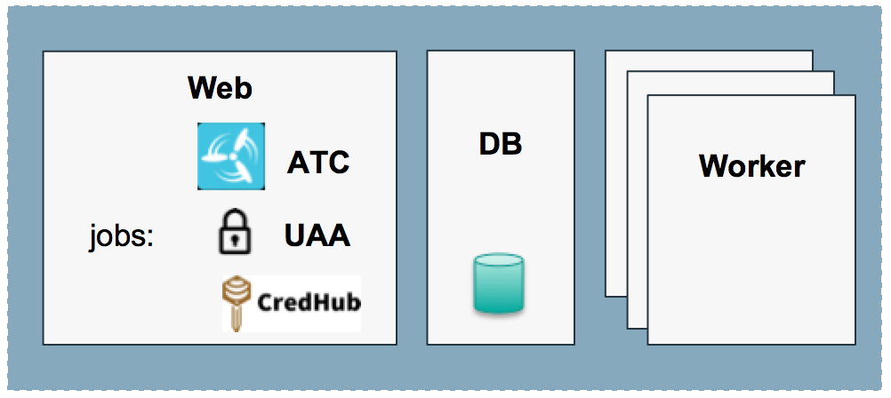

# Concourse Pipelines Integration with CredHub

[Concourse](http://concourse-ci.org/creds.html) supports integration with [CredHub](https://github.com/pivotal-cf/credhub-release/tree/master/docs) for credentials management in its pipelines, which can reference encrypted secrets stored in a CredHub server and get them automatically interpolated during execution of tasks.

This article provides samples of deployment manifests and pipelines for the integration of a BOSH-deployed Concourse server with CredHub. See the [documentation page](http://concourse-ci.org/creds.html) for information about CredHub integration with a Concourse server deployed using some other method.

## Table of Contents

- [Concourse Configuration](#concourse-configuration)
- [Integration Topologies](#integration-topologies)
- [Deploying a CredHub server colocated with a Concourse VM](#colocated-credhub-sample)
- [Adding secrets to CredHub](#credhub-bootstrap)
- [Sample pipeline to use CredHub secrets](#sample-pipeline)
- [Configuring a UAA client for Concourse-CredHub integration](#uaa-client-setup)

---
## <a name="concourse-configuration"></a> Concourse Configuration

Concourse can be integrated with a CredHub server by configuring its [ATC job's deployment properties](https://bosh.io/jobs/atc?source=github.com/concourse/concourse#p=credhub) with information about the CredHub server and corresponding UAA authentication credentials.

Here is an excerpt of a Concourse deployment file sample:
```
jobs:
- name: atc
  ...
   properties:
    ...
    credhub:
      url: https://<cred_hub_server_ip_or_fqdn>:<credhub_server_port>
      tls:
        ca_cert: <cred_hub_server_ca>
      client_id: <uaa_client_id_for_concourse>
      client_secret: <uaa_client_secret_for_concourse>
```

A `client_id` and a `client_secret` are required to be created on the UAA server that manages authentication for CredHub. Concourse will use those credentials to access the CredHub API endpoint (i.e. `https://<cred_hub_server_ip_or_fqdn>:<credhub_server_port>`) and request values of secrets injected into a pipelines.

See [this section](#uaa-client-setup) for an example on how to configure `client_id` and `client_secret` with the UAA server.

---
## <a name="integration-topologies"></a> Integration Topologies

#### a. Independent CredHub Server

If the CredHub server already exists or if it is deployed on an independent set of dedicated VMs ([see docs](https://github.com/pivotal-cf/credhub-release/blob/master/docs/bosh-install-with-credhub.md)), then two steps are required to integrate Concourse with it:

1. Make sure that the Concourse ATC VM can access the CredHub API endpoint and
2. Configure a set of `client_id` and `client_secret` properties on the CredHub's UAA for authentication. See section [Configuring a UAA client for Concourse-CredHub integration](#uaa-client-setup) for an example.

See [CredHub documentation](https://github.com/pivotal-cf/credhub-release/tree/master/docs) for more information on CredHub server deployment alternatives.

#### b. CredHub Server colocated with Concourse ATC

In certain cases, such as experimental deployments or environments that do not require an independent CredHub server, CredHub can be deployed as a set of jobs colocated in the same VM as Concourse's ATC.



This integration approach provides a CredHub server that is dedicated to the Concourse pipelines and is fully managed by Concourse administrators. Also, during Concourse upgrades, the CredHub server will only be down when Concourse ATC job is also down, minimizing potential credential server downtime for pipelines.

[This deployment manifest](samples/concourse-with-credhub.yml) provides an example of how both `credhub` and `uaa` jobs could be deployed along with Concourse's ATC VM.

---
## <a name="colocated-credhub-sample"></a> Deploying a CredHub server colocated with a Concourse VM

**Requirements**  
  - **Bosh Director** to orchestrate and manage the
  Concourse and CredHub deployment. Please refer to [bosh.io](https://bosh.io/docs/init.html) for documentation on how to deploy and [connect](https://bosh.io/docs/director-users-uaa.html) to a Bosh Director for your specific IaaS.
  - [**Cloud Config**](https://bosh.io/docs/update-cloud-config.html) set to the Bosh Director to define network, disk and VM settings.


1. Create and update your **Concourse deployment YML file** containing the CredHub jobs defined as part of the Concourse's `web` VM. See this [deployment file](samples/concourse-with-credhub.yml) as an example for a starting point, or use the [operations files](samples/colocated-credhub-ops) provided in this repo to transform an existing manifest.

2. Configure [concourse-with-credhub-params.yml](samples/concourse-with-credhub-params.yml) with the corresponding values for your deployment.

3. Upload required release files to the Bosh Director.
   - [Concourse](https://bosh.io/d/github.com/concourse/concourse)
   - [Garden](https://bosh.io/d/github.com/cloudfoundry/garden-runc-release)
   - [Postgres](https://bosh.io/releases/github.com/cloudfoundry/postgres-release)
   - [CredHub](https://bosh.io/releases/github.com/pivotal-cf/credhub-release)
   - [UAA](https://bosh.io/releases/github.com/cloudfoundry/uaa-release)

4. Deploy Concourse and CredHub with the [Bosh CLI](https://bosh.io/docs/cli-v2.html):  
   Example:  
   `bosh -e <bosh-alias> -d concourse deploy concourse-with-credhub.yml -l concourse-with-credhub-params.yml --vars-store=./concourse-gen-vars.yml`

   The sample deployment manifest uses the feature of automatic generation of variables, certificates and keys from Bosh (see `variables` section of the file). Bosh will will add the values of the newly crated variables to a local file (defined by `--vars-store`) for future reference purposes.

Once the deployment is finished, all servers will be available from the `concourse_host` IP address or domain name set in the `concourse-with-credhub-params.yml` file.  
- *Concourse*: `https://<concourse_host>:443`
- *CredHub*: `https://<concourse_host>:8844`
- *UAA*: `https://<concourse_host>:8443`

---
## <a name="credhub-bootstrap"></a> Adding secrets to CredHub

- Download the [CredHub CLI](https://github.com/cloudfoundry-incubator/credhub-cli)

- Target the CredHub API endpoint  

  `credhub api https://<concourse_host>:8844 --ca-cert <cred_hub_server_ca>`  

  For the server deployed in the example above, you can use Bosh 2's interpolate command to retrieve generated certificates and variables:  

  `credhub api https://https://<concourse_host>:8844:8844 --ca-cert <(bosh int ./concourse-gen-vars.yml --path /concourse-tls/ca)`  

- Set CREDHUB_PASSWORD environment variable  

  `export CREDHUB_PASSWORD=$(bosh int ./concourse-gen-vars.yml --path /uaa-users-admin)`

- Login to CredHub  

  `credhub login -u admin -p "$CREDHUB_PASSWORD"`

- Create credentials using the path required by Concourse

  Concourse will search for secrets using the path setup for the CredHub integration in its deployment file. By default such path is `/concourse/<team-name>/<pipeline-name>/<secretId>`.
  If the secret is not found, Concourse will then search it again at the corresponding `team-name` level, e.g. `/concourse/<team-name>/secretId`.

  For example, to create a team-level secret of ID `hello` with the CredHub using the cli:  
  `credhub set --type value --name '/concourse/myteam/hello' --value 'World'`

  It is also possible to bulk import credentials into CredHub. See the [documentation](https://credhub-api.cfapps.io/#bulk-import) and [this sample](
  https://gist.github.com/gdenn/3134b970d1262005eab1a95464e0d0f7) import file for more information.  

---
## <a name="sample-pipeline"></a> Sample pipeline to use CredHub secrets

To refer to a CredHub secret in a Concourse pipeline, simply add the <secretId> within double parenthesis to the pipeline.

For example, [samples/hello-credhub.yml](samples/hello-credhub.yml):
```
jobs:
- name: hello-credhub
  plan:
  - do:
    - task: hello-credhub
      config:
        platform: linux
        image_resource:
          type: docker-image
          source:
            repository: ubuntu
        run:
          path: sh
          args:
          - -exc
          - |
            echo "Hello $WORLD_PARAM"
      params:
        WORLD_PARAM: ((hello))

```

The parameter definition `WORLD_PARAM: ((hello))` tells Concourse to retrieve secret `/concourse/<team-name>/<pipeline-name>/hello` or `/concourse/<team-name>/hello` from CredHub during that pipeline execution.
If the secret exists, then Concourse will proceed with running the pipeline using the retrieved value (it should print "Hello World"), otherwise it will halt the pipeline with the corresponding error message.

---
## <a name="uaa-client-setup"></a> Configuring a UAA client for Concourse-CredHub integration

A client ID with authorities `credhub.write, credhub.read` is required to be set in UAA for the Concourse-CredHub integration to work.
Such client ID can be created either with the [`uaac` cli](https://github.com/cloudfoundry/cf-uaac) or by updating UAA's deployment with such settings.

Here is an excerpt of a UAA job's `clients` section that defines a `concourse_to_credhub` client ID:
```
clients:
  ...
  concourse_to_credhub:
    override: true
    authorized-grant-types: client_credentials
    scope: ""
    authorities: credhub.read,credhub.write
    access-token-validity: 30
    refresh-token-validity: 3600
    secret: ((concourse_to_credhub_secret))
```

Refer to [CredHub](https://github.com/pivotal-cf/credhub-release/tree/master/docs) and [UAA](https://docs.cloudfoundry.org/uaa/uaa-user-management.html) documentation pages for more information on the setup of the required client ID.

---
## <a name="references"></a> References

- [Concourse Credentials Management](http://concourse-ci.org/creds.html)

- [CredHub Bosh Release](https://github.com/pivotal-cf/credhub-release)
- [CredHub CLI repository](https://github.com/cloudfoundry-incubator/credhub-cli)
- [CredHub API & CLI reference](https://credhub-api.cfapps.io)
- [UAA](https://docs.cloudfoundry.org/uaa/uaa-user-management.html)
- [UAAC cli](https://github.com/cloudfoundry/cf-uaac)
