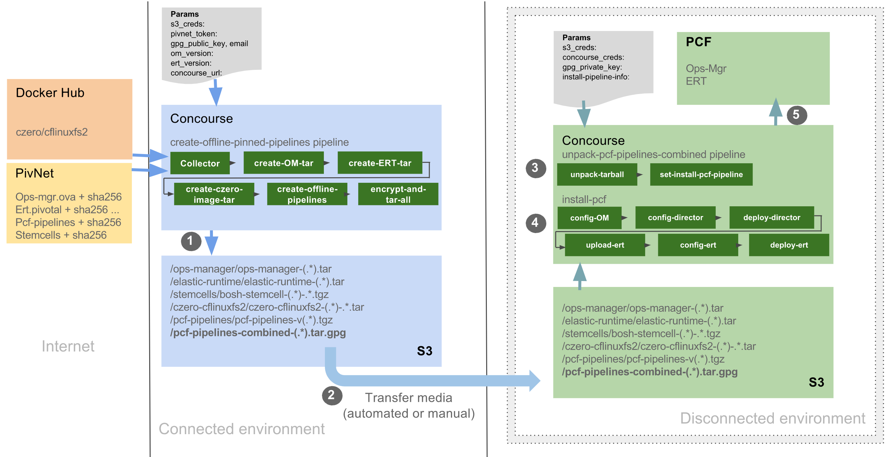
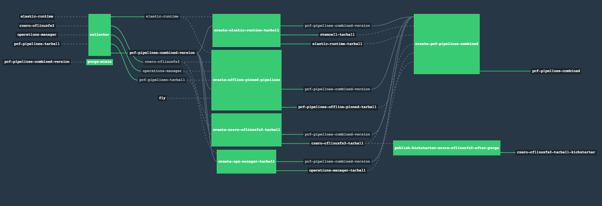
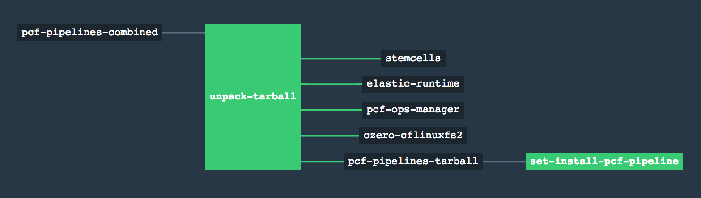

## Offline Pipelines for Airgapped Environments

Offline Pipelines are a solution for computer networks physically isolated from the Internet.

All resources must be provided from within the airgapped environment. For this to happen they first have to be downloaded and packaged in an Internet connected network.

### Implementation

The Offline Pipelines rely on Concourse's [s3-resource](https://github.com/concourse/s3-resource). There are many S3-compatible blobstores that can be used from within airgapped environments such as [Minio](https://minio.io/) and [Dell EMC Elastic Cloud Storage](https://www.dellemc.com/en-us/storage/ecs/index.htm).

#### Bootstrap

The offline environment is bootstrapped with help of two pipelines, `create-offline-pinned-pipelines` and `unpack-pcf-pipelines-combined`, that are meant to be used to facilitate physical transfer of artifacts to the airgapped environment.

[`create-offline-pinned-pipelines`](https://github.com/pivotal-cf/pcf-pipelines/tree/master/create-offline-pinned-pipelines) is used to:

* Pull all required resources (images, products and pipelines) from their locations on the Internet and package them
* Transform `pcf-pipelines` to consume the resources from S3-compatible blobstore,
* Create an encrypted tarball with all resources, and a shasum manifest for each resource,
* Put the tarball to a location within S3 storage for it to be transferred to the airgapped environment.

[`unpack-pcf-pipelines-combined`](https://github.com/pivotal-cf/pcf-pipelines/tree/master/unpack-pcf-pipelines-combined) is used to:

* Download, decrypt, and extract the GPG-encrypted tarball into its components after it has transferred to the `pcf-pipelines-combined/` path in S3-compatible store,
* Verify the `shasum` manifest of the tarball contents,
* Put the tarball parts into their appropriate locations within the airgapped S3 storage for use by the pipelines.

From this point the `pcf-pipelines` folder in the configured S3 bucket in the airgapped environment contains the pcf-pipelines tarball that can then be used to set a pipeline on an airgapped Concourse, in the same fashion as a standard `pcf-pipelines` setup.

### Requirements

* The online environment must have access to Dockerhub and Pivnet
* Concourse 3.3.3+ in both online and airgapped environments

#### Bootstrapping

For the `unpack-pcf-pipelines-combined` to work there must be a single manual transfer of the czero-cflinuxfs2 tarball to the czero-cflinuxfs2 folder within the airgapped environment's S3 storage. Only after that is done can the `unpack-pcf-pipelines-combined` pipeline be set and unpaused.
