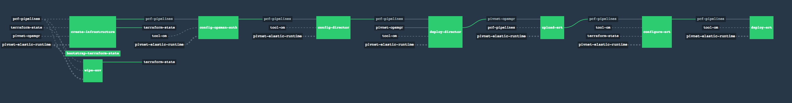

# PCF on Azure



This pipeline uses Terraform to create all the infrastructure required to run an
HA PCF deployment on Azure per the Customer[0] [reference
architecture](http://docs.pivotal.io/pivotalcf/1-10/refarch/azure/azure_ref_arch.html).

## Prerequisites

- [install a Concourse server](https://concourse-ci.org/installing.html)
- download the [Fly CLI](https://concourse-ci.org/fly-cli.html) to interact with the Concourse server
- depending on where you've installed Concourse, you may need to set up
[additional firewall rules](FIREWALL.md "Firewall") to allow Concourse to reach
third-party sources of pipeline dependencies
- ensure you have set up DNS and certs correctly, for example, our pipelines require that you have set up the Ops Manager url with `opsman` as a prefix.

## Usage

This pipeline downloads artifacts from DockerHub (pcfnorm/rootfs and custom
docker-image resources) and the configured Azure Storage Container
(terraform.tfstate file), and as such the Concourse instance must have access
to those. Note that Terraform outputs a .tfstate file that contains plaintext
secrets.

0. [Install jq](https://stedolan.github.io/jq/download/) to run the scripts below.

1. Create an Azure Active Directory Service Principal for your subscription with
the `Contributor` Role on the target Azure Project.

   Set your Subscription ID to the subscription that will be used by the install-pcf pipeline:

   ```
   export SUBSCRIPTION_ID=<YOUR-SUBSCRIPTION-ID>
   export SERVICE_PRINCIPAL_PASSWORD=<SOME-PASSWORD>
   ```

   ```
   az ad app create --display-name "PCFServiceAccount" \
     --homepage "http://pcfserviceaccount" \
     --identifier-uris "http://pcfserviceaccount" \
     --password "$SERVICE_PRINCIPAL_PASSWORD" | tee app_create.json

   export APP_ID="$(jq -r .appId app_create.json)"

   az ad sp create --id "$APP_ID"

   az role assignment create --assignee "http://pcfserviceaccount" \
     --role "Contributor" \
     --scope "/subscriptions/$SUBSCRIPTION_ID"
   ```

2. Create an Azure Storage Account and Container to store terraform.tfstate

   ```
   az group create --name "pcfci" \
     --location "WestUS"

   az storage account create --name "pcfci" \
     --resource-group "pcfci" \
     --location "WestUS" \
     --sku "Standard_LRS"

   AZURE_STORAGE_ACCOUNT_KEY=$(az storage account keys list --account-name pcfci --resource-group pcfci | jq -r .[0].value)

   az storage container create --name terraformstate \
     --account-name pcfci
   ```

3. Download `pcf-pipelines` from [Pivotal Networks](https://network.pivotal.io/products/pcf-automation)

4. Update `pcf-pipelines/install-pcf/azure/params.yml` and replace all variables/parameters.

    - The sample pipeline params file includes 2 params that set the major/minor versions of
      OpsMan and ERT that will be pulled.  They will typically default to the latest available tiles.
      ```
      opsman_major_minor_version: ^2\.1\.[0-9]+$ # Ops Manager minor version to track (e.g ^2\.1\.[0-9]+$ will track 2.0.x versions)
      ert_major_minor_version: ^2\.1\.[0-9]+$ # ERT minor version to track (e.g ^2\.1\.[0-9]+$ will track 2.0.x versions)
      ```

5. Log into concourse and create the pipeline.

   ```
   fly -t lite set-pipeline -p install-pcf-azure \
     -c pcf-pipelines/install-pcf/azure/pipeline.yml \
     -l pcf-pipelines/install-pcf/azure/params.yml
   ```

6. Un-pause the pipeline.

7. Run the `bootstrap-terraform-state` job. This will create a `terraform.tfstate` in your storage
container to be used by the pipeline.

8. Run the `create-infrastructure` job. This will create all the infrastructure necessary for your
PCF installation.

9. Create an NS record within the delegating zone with the name servers from the newly created zone. To retrieve the nameservers that should be used for delegating to the new zone, run the following:
   ```
   az network dns zone show --name "<PCF-ERT-DOMAIN>" \
     --resource-group "pcfci"
   ```

   This should return JSON containing a `nameServers` array. To check if your domain
is resolvable, run the following:

   ```
   dig <PCF-ERT-DOMAIN>
   ```

10. Once DNS is resolvable, run the `config-opsman-auth` job. From there the pipeline should automatically run through to the end.


# Troubleshooting

#### Error message: ####
   ```
   “{”errors”:{“.properties.networking_point_of_entry.external_ssl.ssl_ciphers”:[“Value can’t be blank”]}}”
   ```
   
   **Solution:** pcf-pipelines is not compatible with ERT 1.11.14. Redeploy with a [compatible](https://github.com/pivotal-cf/pcf-pipelines#install-pcf-pipelines) version. 

#### Error message: ####

    Error
    pcf-pipelines/tasks/stage-product/task.sh: line 19: ./pivnet-product/metadata.json: No such file or directory


  **Solution:** You are not using the PivNet resource, and are most likely using a different repository manager like Artifactory. For more information, and a possible workaround, see this github [issue](https://github.com/pivotal-cf/pcf-pipelines/issues/192). 


## Known Issues

- The multi resource group functionality is still WIP. Please see this github [issue](https://github.com/pivotal-cf/pcf-pipelines/issues/184) for more details. 

- Terraform introduced a [bug](https://github.com/terraform-providers/terraform-provider-azurerm/pull/772) recently in the `DNSSettings` property. We've pushed out a [fix](https://www.pivotaltracker.com/story/show/154810872) but we’ve yet to release a rc. If you are using v23, you should lock the provider version to `1.0.0`

- If you are using pcf-pipelines v23 or older, Terraform [hardcodes](https://github.com/pivotal-cf/pcf-pipelines/blob/v0.23.0/install-pcf/azure/terraform/c0-azure-base/dns.tf#L19) the apps domain name to `cfapps`. The workaround for this is by adding `*.apps` to your Azure DNS Zone.

- If you are using pcf-pipelines v17 (PCF 1.11), and you are using TCP and Spring Cloud Services with keepalives enabled, if your ALBs are not set with a timeout of 30 minutes, you could run into a situation whereby the ALB will close the idle connection prematurely. If you are on PCF 1.12 or later, the workaround for this is to go into ERT/PAS ---> Networking and set the Frontend Idle Timeout for GoRouter and HAProxy to a sensible [number](https://docs.pivotal.io/pivotalcf/2-0/customizing/azure-er-config.html#networking). 


