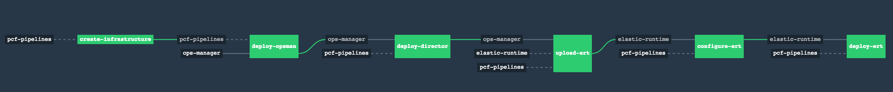

# PCF on OpenStack



This pipeline assumes all of the infrastructure required to run a
PCF deployment on Openstack per the Customer[0] has been pre-provisioned [reference
architecture](http://docs.pivotal.io/pivotalcf/1-10/refarch/openstack/openstack_ref_arch.html).

## Usage

This pipeline downloads artifacts from DockerHub (czero/rootfs and custom
docker-image resources) and Pivotal Network, and as such the Concourse instance
must have access to those.

1. Download the `Openstack RC File v3` from `Compute > Access & Security`. This will
   be used in your `params.yml`

2. Update params.yml and replace all #CHANGEME values with the relevant information.

    - The sample pipeline params file includes 2 params that set the major/minor versions of
      OpsMan and ERT that will be pulled. They will typically default to the latest available tiles.
      ```
      opsman_major_minor_version: 2\.[0-9\]+\.[0-9]+$
      ert_major_minor_version: 2\.[0-9\]+\.[0-9]+$
      ```

    - NOTE: The pipeline also utilizes an s3 compatible bucket for terraform state.

3. [Set the pipeline](http://concourse.ci/single-page.html#fly-set-pipeline), using your updated params.yml:

    ```
    fly -t lite set-pipeline -p deploy-pcf -c pipeline.yml -l params.yml
    ```

4. Unpause the pipeline
5. Trigger the `create-infrastructure` job.
6. Setup DNS.

    - The create infrastructure job will create floating IPs in your external net for OpsMan and HAProxy.
      The output of the `create-infrastructure` job exposes these floating IPs. These should be set as follows:
      ```
      *.cfapps.openstack.customer0.net -> HAProxy Floating IP
      opsman.openstack.customer0.net -> OpsMan Floating IP
      *.sys.openstack.customer0.net -> HAProxy Floating IP
      ```
7. Set `haproxy_floating_ips:` param to the HAProxy floating IP value, set the pipeline again like in step 3.

8. Trigger the `configure-director` job.

    - The rest of the pipeline should automatically trigger.

### Tearing down the environment

There is a job, `wipe-env`, under the `teardown` group, which you can run to 
destroy the foundation and infrastructure deployed by the pipeline.

If you want to bring the environment up again, run `create-infrastructure`.

## Known Issues

### Failing Runtime Smoke Tests

The runtime smoke tests in the `deploy-ert` may fail, despite successful overall deployment. 
Running [CF smoke tests](https://github.com/cloudfoundry/cf-smoke-tests/blob/master/README.md) manually should succeed.

### Single AZ

Currently this pipeline only supports a single AZ deployment. Once a test
environment with multiple AZs is available, this functionality will be fully
fleshed out and incorporated into the pipeline. In the meantime, the other
two AZ defintions can remain commented out.

### MySQL Monitor

There is the possibilty of random running into `deploy-ert` failures with
the `mysql_monitor` job failing to start. This is a known issue and can
currently only be fixed by scaling down the `mysql_monitor` job to 0 instances
after editing a metadata file on the Ops Manager vm. You can run the following
steps as a workaround to this issue, and then re-run the `configure-ert` and
`deploy-ert` steps:

  - ssh into Ops Manager,
  - `sudo grep "Pivotal Elastic Runtime" /var/tempest/workspaces/default/metadata/*` 
  - `sudo vi the newest file`
  - search "name: mysql_monitor" job,
  - remove below section from the instance_definition of the job:
    ```
    zero_if:
      property_reference: ".properties.system_database"
      property_values:
      - external
    ```
  - Change `mysql_monitor_instances` to `0` in your `params.yml` and fly the changes

After a successful deployment, navigate to the Ops Man UI and change the value
for MySQL Monitor Instances back to 1 and apply changes
  - "Ops Manger > ERT > Resource Config", Apply Change.

### Missing Jumpbox
* There is presently no jumpbox installed as part of the infrastructure creation.

## Troubleshooting

#### Error message: ####
   ```
   “{”errors”:{“.properties.networking_point_of_entry.external_ssl.ssl_ciphers”:[“Value can’t be blank”]}}”
   ```
   
   **Solution:** pcf-pipelines is not compatible with ERT 1.11.14. Redeploy with ERT v1.11.8. 
