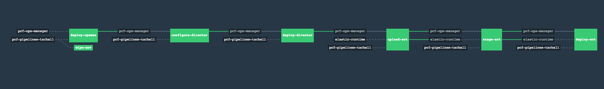

# PCF on vSphere



This pipeline deploys a PCF deployment on vSphere per the Customer[0]
[reference architecture](http://docs.pivotal.io/pivotalcf/refarch/vsphere/vsphere_ref_arch.html).
This pipeline assumes the underlying infrastructure has been prepared for a PCF
to be deployed on it.

## Prerequisites

* vSphere 6.x or greater
* vSphere NSX 6.1 or greater
* vCenter Account with the permissions as detailed in
  [vSphere Service Account Permissions](https://docs.pivotal.io/pivotalcf/customizing/vsphere-service-account.html).
* At least 1 of the following: *Standard Port Group*, *Distributed Port Group*,
  *Logical Switch* for an `uplink` port group.
  * This port group must have a network that is routable in the environment.
    This is the uplink network.
* A *Distributed Port Group* for an `uplink` port group, required for DLR
  uplink - as the transit network between the deployed ESG and the DLR, if the
  DLR option is enabled.
  * This port group must have a network that is routable in the environment.
    This is the uplink network.
* DNS zone with the following records:
  * `opsman.<pcf-domain>` -> Opsman VIP
  * `*.sys.<pcf-domain>` -> ERT VIP
  * `*.uaa.sys.<pcf-domain>` -> ERT VIP
  * `*.login.sys.<pcf-domain>` -> ERT VIP
  * `*.cfapps.<pcf-domain>` -> ERT VIP
  * `ssh.sys.<pcf-domain>` -> SSH Proxy VIP
  * Additional entries for each isolation segment added.
* SSL Certificate for your PCF domain.
  * The SSL Certificate needs `*.<pcf-domain>` as the common name.
  * Additionally the certificate needs the following SANs:
  * `*.sys.<pcf-domain>`
  * `*.uaa.sys.<pcf-domain>`
  * `*.login.sys.<pcf-domain>`
  * `*.cfapps.<pcf-domain>`
* At least five routable IP addresses on the uplink network for the NSX Edge Load
  Balancer VIPs and NAT configuration:
  * NSX Edge Primary Uplink Interface IP (Default SNAT)
  * DNAT VIP - Opsman
  * Load Balancer VIP - HTTP/HTTP(s) (Go Routers)
  * Load Balancer VIP - SSH Proxy (Diego Brains)
  * Load Balancer VIP - TCP Router(s)
  * Any additional IP addresses for exposed isolation segments

## Usage

This pipeline downloads artifacts from DockerHub (czero/rootfs and custom
docker-image resources), and as such the Concourse instance must have access
to those.

1. Ensure that the NSX edge is properly setup as detailed in the
[Pivotal vSphere NSX Cookbook](http://docs.pivotal.io/pivotalcf/refarch/vsphere/vsphere_nsx_cookbook.html).

2. Update all params in the `params.yml` with the proper values.

3. [Set the pipeline](http://concourse.ci/single-page.html#fly-set-pipeline), using your updated `params.yml`:
  ```
  fly -t lite set-pipeline -p deploy-pcf -c pipeline.yml -l params.yml
  ```

4. Unpause the pipeline in Concourse.

5. Trigger the `deploy-opsman` job.

## Troubleshooting

#### Error message: ####
   ```
   “{”errors”:{“.properties.networking_point_of_entry.external_ssl.ssl_ciphers”:[“Value can’t be blank”]}}”
   ```

   **Solution:** pcf-pipelines is not compatible with ERT 1.11.14. Redeploy with
   a [compatible](https://github.com/pivotal-cf/pcf-pipelines#install-pcf-pipelines)
   version.


#### Error message: ####

    Error
    pcf-pipelines/tasks/stage-product/task.sh: line 19: ./pivnet-product/metadata.json: No such file or directory


  **Solution:** You are not using the PivNet resource, and are most likely using
  a different repository manager like Artifactory. For more information, and a
  possible workaround, see this github [issue](https://github.com/pivotal-cf/pcf-pipelines/issues/192).
  
  
  #### Error message: ####

    could not execute "configure-bosh": tile failed to configure: request failed: unexpected response:
    HTTP/1.1 422 Unprocessable Entity
    ...
    <!DOCTYPE html>
    <html>
    <head>
    <meta content='text/html; charset=utf-8' http-equiv='Content-Type'>
    ...


  **Solution:** If you are using pcf-pipelines v23, there is an issue in the params.yml with inverted quotations. (For example, `bosh_disk_path: “pcf_disk”`.) To resolve this issue, remove all instances of inverted quotations from your params.yml, and add regular quotations (For example, `bosh_disk_path: "pcf_disk"`.).
